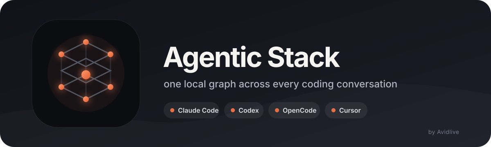

<p align="center">
  
</p>

<h1 align="center">Agentic Stack</h1>

<p align="center">
  A native macOS workspace that gives your coding agents one shared memory.
</p>

<p align="center">
  <a href="https://github.com/codejunkie99/agentic-stack-desktop/releases"></a>
  <a href="LICENSE"></a>
  
  
</p>

Agentic Stack finds your local **Claude Code**, **Codex**, **OpenCode**, and
**Cursor** history, turns approved material into a searchable knowledge graph,
and lets every tool reference earlier conversations. Your source chats stay
read-only and on your machine.

## Features

### Conversations and custom agents

- Run Claude Code and Codex in a conversation-first workspace with streamed
  replies, tool activity, cancellation, retry, and official CLI session resume.
- Create reusable agents with a name, role, instructions, runner, model,
  reasoning effort, and read-only or project-edit file access.
- Let Auto route each message with a Faster, Balanced, or Stronger priority, or
  pin a searchable fixed model and one of its supported effort levels. The
  picker previews the model for the current message and records the final reason.
- Attach images, PDFs, audio, video, text, and code from the composer. Files are
  bounded, staged with a MIME type, byte count, digest, and local path, and
  retained as metadata rather than encoded payloads in task history.

### Context from every conversation

- Ask a question such as “what did the cache subagent find?” from any connected
  coding tool. One read-only recall call returns bounded transcript evidence,
  imported knowledge, personal project context, timestamps, paths, and digests.
- Type a plain `@` to get prompt-aware suggestions from Claude Code, Codex,
  OpenCode, and Cursor across all detected projects and workspaces.
- Narrow results by tool, model, scope, or role: primary agent, subagent,
  automation, or review agent. Search uses visible conversation text as well as
  titles and excerpts.
- Attach up to five conversations as removable context chips. Agentic Stack
  cleans, bounds, digests, and freezes the chosen context into the next run.
- Install the same search as a local MCP integration in all four tools, so
  `@Claude`, `@Codex`, `@OpenCode`, and `@Cursor` keep the same meaning wherever
  you work.
- Give agents read-only MCP tools for model recommendations and the current
  project's personal profile and work context.

### Shared memory and knowledge graph

- Preview and import approved memories, rules, skills, documents, and selected
  conversations into a local SQLite full-text index.
- Explore the graph in interactive 3D or 2D, expand it into a full-page canvas,
  orbit and zoom through provider clusters, search notes, filter by topic or
  source, inspect provenance, and attach retrieved evidence to a task.
- Let completed agent work propose one explicit reusable lesson automatically,
  then accept, reject, reopen, or retract it while preserving the originating
  agent, run, task, and decision history.
- Deduplicate unchanged imports while retaining the original source path,
  position, timestamp, and content digest.
- Inspect **Personal memory** as a separate profile: stable preferences, current
  project focus, and query-specific reviewed matches keep their source visible.

### Tasks, operations, and terminal

- Start project tasks in planning/read-only or project-edit mode, watch progress,
  inspect errors and final output, cancel owned work, and mark results reviewed.
- Run and resume bounded maker/verifier/checker loops with budgets, checkpoints,
  deny paths, worktrees, and explicit stop controls.
- Open real interactive Claude Code, Codex, and shell terminals inside the app.
  Terminal tabs support ANSI output, permission prompts, resize, copy/paste,
  interruption, and reconnection.
- Use packaged operations for project health, adapter management, memory
  transfer, stack status, upgrades, loop validation, and Brain diagnostics.

### Projects, integrations, and migration

- Open an existing repository or create a managed project, then initialize only
  the missing Agentic Stack files.
- Auto-detect Claude Code, Codex, OpenCode, and Cursor installations, versions,
  local data, and supported skill locations on the selected Mac or server.
- Complete guided setup for the project, detected tools, preferences, optional
  features, and a review of every change before it is applied.
- Preview portable Markdown, text, JSON, and JSONL exports before importing.
  Existing customized files are preserved and conflicting settings are surfaced.

### Overview, skills, rules, and handover

- Use the Work → Overview dashboard for the task composer, priority queue,
  active/review counts, agent launch controls, and knowledge coverage.
- Browse local and shared skills, inspect their instructions and support files,
  and copy complete skills into a project or a supported coding tool.
- Edit project protocols for permissions, delegation rules, and tool schemas.
- Export reviewed references as Markdown handovers or portable context bundles.

### Local and hosted operation

- Keep the entire stack local, or connect the native app to a private Agentic
  Stack server over HTTPS or a localhost SSH tunnel.
- Store the server control token in macOS Keychain, switch between hosts, export
  a self-contained server package, and keep each host's projects and graph
  separate.
- Use Sparkle to install signed updates while keeping projects, conversations,
  agents, graph data, and settings outside the replaceable app bundle.

See the [complete feature reference](docs/features.md) for workflows, storage,
privacy boundaries, keyboard shortcuts, and current limits.

## Desktop support

| Tool | Local history | `@` references | Knowledge import | Run from app |
| --- | :---: | :---: | :---: | :---: |
| Claude Code | ✓ | ✓ | ✓ | ✓ |
| Codex | ✓ | ✓ | ✓ | ✓ |
| OpenCode | ✓ | ✓ | ✓ | — |
| Cursor | ✓ | ✓ | ✓ | — |

OpenCode and Cursor are read-only context sources in the current desktop.
Agent execution uses the official Claude Code and Codex CLIs and their existing
accounts. Agentic Stack does not copy provider tokens or implement a substitute
OAuth client.

## Download

**[Download Agentic Stack for macOS](https://github.com/codejunkie99/agentic-stack-desktop/releases/download/v0.19.1-desktop-preview.11/Agentic-Stack-macOS-arm64.dmg)**

This preview supports Apple Silicon Macs running macOS 14 or later. Open the
DMG, drag **Agentic Stack** to **Applications**, then launch it from there.
Because the preview is not Apple-notarized, the first launch may require
**System Settings → Privacy & Security → Open Anyway**. You can verify the
[published SHA-256 checksum](https://github.com/codejunkie99/agentic-stack-desktop/releases/download/v0.19.1-desktop-preview.11/Agentic-Stack-macOS-arm64.dmg.sha256.txt).

For a normal first launch without the Gatekeeper dialog, install the same
verified release from Terminal:

```sh
curl -fsSL https://raw.githubusercontent.com/codejunkie99/agentic-stack-desktop/main/scripts/install-macos.sh | bash
```

The installer requires no `sudo`. It verifies the pinned release checksum and
bundle signature before copying Agentic Stack into `~/Applications`. Review
[the installer](scripts/install-macos.sh) before running it if you prefer.

### Updating

Choose **Agentic Stack → Check for Updates…**. Sparkle 2 checks the HTTPS appcast,
verifies the release with Agentic Stack's Ed25519 key, installs it, and
relaunches the app. It can also check automatically after asking you first. The
DMG remains the fallback if an update cannot install.

Your graph, conversations, agents, and settings remain in
`~/Library/Application Support/Agentic Workspaces`, outside the replaceable app
bundle. Back up that folder before a major migration.

## Quick start

Requirements: macOS 14+, Python 3.10+, Xcode Command Line Tools, and at least
one supported coding tool.

```sh
git clone https://github.com/codejunkie99/agentic-stack-desktop.git
cd agentic-stack-desktop
./install.sh desktop --build
```

Then:

1. Open a repository.
2. Complete **Guided setup** to detect installed tools.
3. Open **Knowledge Graph → Import memory…** and approve the sources you want.
4. Select an agent and start a conversation.

The app is currently ad hoc signed. For a local build, macOS may ask you to
confirm the first launch. Sparkle 2 authenticates preview updates with EdDSA;
Developer ID signing and notarization are a separate, optional route for Apple
first-launch trust.

## Use `@` in all four tools

In the desktop, open **Tools → Connections → Use @ in tools → Enable in all
four tools**. The equivalent command is:

```sh
agentic-stack context install
```

This adds one reversible local MCP entry named `agentic-stack` to Claude Code,
Codex, OpenCode, and Cursor. A plain `@` suggests relevant work from any of the
four tools. `@Claude`, `@Codex`, `@OpenCode`, and `@Cursor` narrow by tool, and
results can also be filtered by model or by primary agent/subagent role. It exposes:

- `recall_context` — answer a natural question across sessions, subagents,
  approved graph memory, and optional project context in one call;
- `search_conversations` — find matching local chats;
- `read_conversation` — read only the chat you selected;
- `search_shared_memory` — query the imported knowledge graph;
- `prepare_context` — build a fixed, budgeted context pack;
- `recommend_model` — suggest a model for a subtask from the live catalog;
- `read_personal_memory` — read bounded project preferences and current work.

Restart open tool windows after installation. Remove only Agentic Stack's MCP
entries with:

```sh
agentic-stack context remove
```

## Knowledge and privacy

Imports are opt-in and bounded. The knowledge graph scanner includes visible
user messages and final assistant replies while excluding reasoning events,
tool payloads, subagent transcripts, hidden files, credential stores, and
credential-like lines. The `@` context search can read sanitized agent and
subagent transcripts directly without importing them. Neither path modifies
the original chat databases or transcript files.

Imported notes remain reference evidence. Completed runs may propose one
explicit reusable lesson, but it stays staged until the owner reviews it; it
does not become a trusted instruction automatically. Re-importing unchanged
content is idempotent, and each note retains its provenance.

## Self-hosting

The macOS app can connect to a persistent single-owner service over HTTPS or an
SSH tunnel. The server owns its projects, graph, task history, and CLI sign-ins;
connecting does not upload the Mac's data automatically.

See the [self-hosting guide](deploy/agentic-stack/README.md) for Docker Compose,
Caddy TLS, sandbox checks, and backup guidance.

## CLI adapter layer

The original portable `.agent/` stack remains available for repository-level
memory, skills, protocols, bounded loops, and additional harness adapters:

```sh
./install.sh claude-code
./install.sh add cursor
./install.sh status
./install.sh doctor
./install.sh dashboard
```

Run `./install.sh help` for the full command list. The desktop product focuses
on Claude Code, Codex, OpenCode, and Cursor; the wider CLI adapter catalog is
kept for existing projects.

Bounded loops use a maker, deterministic verifier, and independent checker:

```sh
agentic-stack loop init /path/to/project
agentic-stack loop run ci-sweeper "make the failing test green" /path/to/project --yes
agentic-stack loop status /path/to/project
```

Loop budgets, worktrees, deny paths, and checkpoints limit execution, but the
supervisor is not an operating-system sandbox. Keep each coding tool's native
sandbox and approval controls enabled.

## Documentation

| Guide | Purpose |
| --- | --- |
| [Complete feature reference](docs/features.md) | Every desktop capability, workflow, privacy boundary, and current limit |
| [Desktop guide](docs/native-workspaces.md) | Features, workflows, shortcuts, and limits |
| [Context layer](docs/context-layer.md) | One-call agent recall, source boundaries, and provenance |
| [Conversation model](docs/conversation-workspace.md) | Sessions, model switching, and attached context |
| [Architecture](docs/architecture.md) | Portable memory and review lifecycle |
| [Self-hosting](deploy/agentic-stack/README.md) | Private server setup and security model |
| [Release process](docs/releasing.md) | Signed Sparkle updates and GitHub assets |
| [Changelog](CHANGELOG.md) | Release history and upgrade notes |

## Development

```sh
python3 -m pytest -q
swift build --package-path apps/macos -c release
python3 scripts/check-desktop-connection.py
bash scripts/build-macos-app.sh --output ./apps/macos/dist
```

Please keep local chat fixtures synthetic, preserve source-store read-only
behavior, and add focused tests for scanner or MCP changes.

## License

Original Agentic Stack code and documentation authored by Avidlive are licensed
under the [Apache License 2.0](LICENSE). Third-party components remain under
their own licenses and are not relicensed by this repository. See the
[licensing guide](docs/licensing.md), [NOTICE](NOTICE), and the
[desktop third-party notices](apps/macos/THIRD-PARTY-NOTICES.md).

Created by [Avidlive](https://x.com/Av1dlive).
